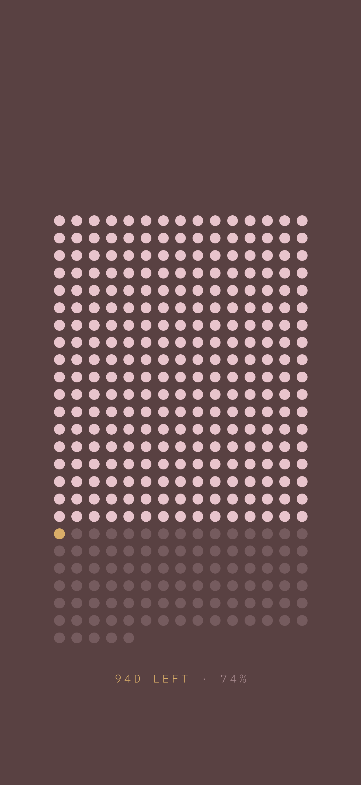

# LifeCal Burgundy

A year-progress wallpaper generator. Each dot is a day of the year: filled dots are days that have passed, the gold dot is today, and the faint dots are days still to come. Below the grid it shows how many days are left and what percentage of the year is done.



## Usage

The image is served from `/days`:

```
https://<your-deployment>/days
```

The defaults fit an iPhone Pro Max screen (1290 × 2796). You can change them with these query parameters:

| Parameter | Default           | Description                                       |
| --------- | ----------------- | ------------------------------------------------- |
| `width`   | `1290`            | Image width in pixels (max 3000)                  |
| `height`  | `2796`            | Image height in pixels (max 4000)                 |
| `tz`      | `America/Chicago` | IANA timezone used to decide what "today" is      |

Example:

```
/days?width=1179&height=2556&tz=America/New_York
```

The CDN caches responses for up to an hour (`s-maxage=3600`).

### Using it as a daily wallpaper

On iOS, create a Shortcuts automation that runs once a day. It should do a **Get Contents of URL** on the `/days` link, then **Set Wallpaper** with the result.

## Customizing

Colors are set in the `THEME` object at the top of [`api/days.js`](api/days.js).

The footer uses [IBM Plex Mono](https://github.com/IBM/plex) Light, bundled in `fonts/` under the SIL Open Font License (`fonts/OFL.txt`).

## Development

```sh
npm install
vercel dev
```

Then open http://localhost:3000/days.

## Deployment

The project deploys on Vercel from GitHub. Pushes to `main` go to production, and pushes to other branches get preview deployments.
